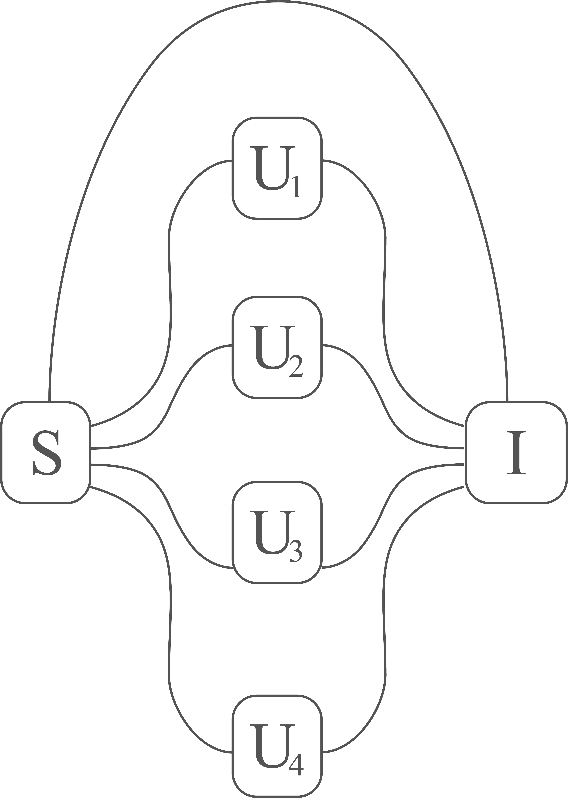

# Authentication scheme

## Network topology

Nodes of the network
- S: Messaging server
- I: Interface (authentication server)
- U1, U2, U3, ... : Users

## Authentication protocol 
The point of the authentication protocol is to establish a series of *secure links* between the server (S) and
each user (U_i). For each user, the messaging server (S) plays the role of Alice and the user (U_i) plays the role 
of Bob. They interact with direct messages to the interface server (I). 

In this way, the basis are shared _only_ between Alice, Bob and the Interface.

The authentication algorithm is as follows:

FOR EACH USER U_i: 
1. S sends MESSAGE_i to I 
2. S sends A_BASIS_i to I 
3. U_i sends B_BASIS_i to I 
4. I execute BB84  
5. I sends RESULTS_i to U_i
6.  U_i sends B_BASIS_i to S
7.  S sends A_BASIS_i to U_i
8.  U_i eliminates bits with wrong basis from RESULTS_i : U_i has key K_i
9.  U_i sends index of bits to be eliminated to S 
10. S eliminates the bits : S has key K_i 
  

